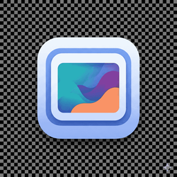
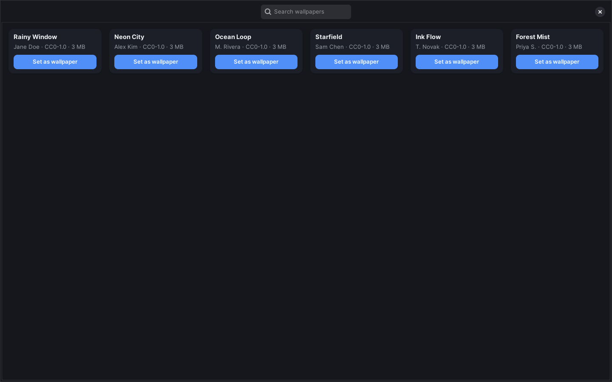

<div align="center">



# Fresco

**Live wallpapers for Linux** — set any video, GIF, or image as an animated desktop wallpaper. A free, open-source **Wallpaper Engine alternative** for **X11 and Wayland** (COSMIC, Hyprland, Sway, KDE Plasma 6, Deepin DDE).

[](https://github.com/DibbayajyotiRoy/fresco/releases/latest)
[](LICENSE)
[](https://github.com/DibbayajyotiRoy/fresco/actions/workflows/publish.yml)
[](https://github.com/DibbayajyotiRoy/fresco/stargazers)

[Website](https://fresco.dibbayajyoti.com) · [Changelog](CHANGELOG.md) · [Issues](https://github.com/DibbayajyotiRoy/fresco/issues)



</div>

## What is Fresco?

Fresco is a video wallpaper app for the Linux desktop: pick a video, GIF, image, slideshow, or playlist, click **Set**, and close the app — the animated wallpaper keeps playing and comes back on login. It's a proper GTK4 GUI (no terminal required) with hardware-accelerated playback, so a live wallpaper costs near-zero CPU.

## Features

- **Any media** — looping video (mp4/webm/mkv), animated GIF, static image, image slideshow, multi-video playlist
- **Add from a link** — paste a Pinterest pin or any direct video/image URL; Fresco downloads it and opens the crop editor
- **Browser new-tab extension** — mirror your wallpaper on every new tab (Chrome/Brave/Edge/Firefox; coming to the extension stores — load unpacked from [`./extension`](extension) today)
- **Hardware decode** — GPU video decoding (VA-API / NVDEC) keeps CPU usage near zero
- **Multi-monitor** — a different wallpaper per display, with synced playback for the same video across monitors
- **Day & night schedules** — swap wallpapers on a timer, arbitrary time slots, or sunrise/sunset
- **Built-in catalog** — browse curated, properly licensed wallpapers in-app
- **Command palette** — Ctrl+K to set any wallpaper or reach any feature from the keyboard
- **Fullscreen auto-pause** — per monitor, including on COSMIC; plus pause-on-battery
- **Deepin DDE support** — on Deepin 25, Fresco adapts the DDE desktop automatically so live wallpapers show through with desktop icons intact
- **Crop & rotate editor**, per-wallpaper sound/volume, slideshow transitions, and a searchable library

## Supported environments

| Environment | Live wallpaper |
|---|---|
| X11 (GNOME, Cinnamon, XFCE, MATE, …) | ✅ |
| Deepin 25 (DDE, X11) | ✅ auto DDE adaptation |
| COSMIC (Wayland) | ✅ layer-shell |
| Hyprland | ✅ layer-shell |
| Sway | ✅ layer-shell |
| KDE Plasma 6 (Wayland) | ✅ layer-shell |
| GNOME on Wayland | ⚠️ static frame fallback (Mutter exposes no live wallpaper surface) |

## Install

**One-liner** (Debian/Ubuntu-based distros):

```bash
curl -fsSL https://github.com/DibbayajyotiRoy/fresco/releases/latest/download/install.sh | FRESCO_SOURCE=github bash
```

**Manual:** download the `.deb` from [Releases](https://github.com/DibbayajyotiRoy/fresco/releases/latest) and run `sudo apt install ./fresco_*.deb`.

**Build from source:** see [docs/INSTALL.md](docs/INSTALL.md).

## Privacy

Fresco can send anonymous usage statistics, but **nothing is sent until you opt in** — a one-time consent dialog asks on first launch, and the choice can be changed anytime in Settings. No personal data, file names, or wallpaper content is ever collected. Details in the [changelog privacy notes](CHANGELOG.md#privacy).

## Contributing & feedback

Bug reports, feature requests, and PRs are welcome — open an [issue](https://github.com/DibbayajyotiRoy/fresco/issues), or use the in-app feedback dialog.

## License

[GPL-3.0-or-later](LICENSE) — free and open source.
