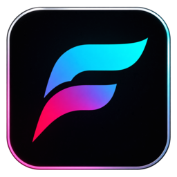
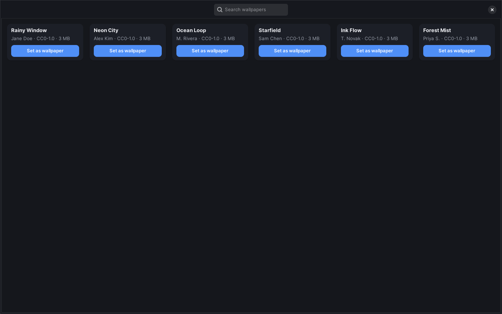

<div align="center">



# Fresco — Live Wallpapers for Linux

**Set any video, GIF, or image as an animated desktop wallpaper.** A free, open-source **Wallpaper Engine alternative for Linux**, working on **X11 and Wayland** (COSMIC, Hyprland, Sway, KDE Plasma 6, Deepin DDE).

[](https://github.com/DibbayajyotiRoy/fresco/releases/latest)
[](LICENSE)
[](https://github.com/DibbayajyotiRoy/fresco/actions/workflows/publish.yml)
[](https://github.com/DibbayajyotiRoy/fresco/stargazers)

**Used by 130+ people around the world.**

[Website](https://fresco.dibbayajyoti.com) · [Install](#install) · [FAQ](#faq) · [Changelog](CHANGELOG.md) · [Issues](https://github.com/DibbayajyotiRoy/fresco/issues)



</div>

## What is Fresco?

Fresco is a free, open-source live wallpaper app for Linux. It sets videos, GIFs, images, slideshows, and video playlists as your animated desktop wallpaper through a GTK4 GUI — no terminal required. Playback is hardware-accelerated through mpv (VA-API / NVDEC), so decoding runs on the GPU and CPU usage stays near idle — see [Performance](#performance-and-battery-life) for what that costs at the wall. It installs as a `.deb` and restores your wallpaper on login.

## Quick facts

| | |
|---|---|
| **What it is** | Live / video wallpaper app for the Linux desktop |
| **Works on** | X11 and Wayland layer-shell (COSMIC, Hyprland, Sway, KDE Plasma 6, Deepin DDE) |
| **Distros** | Ubuntu, Pop!_OS, Linux Mint, Debian, elementary OS, Deepin 25 |
| **Media formats** | mp4, webm, mkv, avi, mov, GIF, jpg/png/webp, slideshows, playlists |
| **Desktop widgets** | Synced lyrics, clock, audio visualiser, album-art disc — drawn into the wallpaper, all off by default |
| **Price** | Free — GPL-3.0-or-later, no ads, no account |
| **Built with** | Rust, GTK4 / libadwaita, libmpv |
| **Install** | `.deb` package or one-line script |
| **Users** | 130+ worldwide |
| **Latest version** | 1.1.39 |

## Install

**One-liner** (Debian, Ubuntu, Pop!_OS, Linux Mint, elementary OS, Deepin):

```bash
curl -fsSL https://github.com/DibbayajyotiRoy/fresco/releases/latest/download/install.sh | FRESCO_SOURCE=github bash
```

**Manual:** download the `.deb` from [Releases](https://github.com/DibbayajyotiRoy/fresco/releases/latest) and run:

```bash
sudo apt install ./fresco_*.deb
```

**Build from source:** see [docs/INSTALL.md](docs/INSTALL.md).

## How to set a video as your wallpaper on Linux

1. Install Fresco (above) and open it from your app launcher.
2. Click **Add** and pick a video, GIF, or image — or paste a link with **From link**.
3. Optionally crop or rotate it in the editor.
4. Click **Set**, then close the app.

The wallpaper keeps playing after the window closes and comes back automatically on login.

## Features

- **Any media** — looping video (mp4/webm/mkv), animated GIF, static image, image slideshow, multi-video playlist
- **Add from a link** — paste a Pinterest pin or any direct video/image URL; Fresco downloads it and opens the crop editor
- **Hardware decode** — GPU video decoding (VA-API / NVDEC) keeps CPU usage near idle by moving the work to the video engine, where it is measurably cheaper (not free — see [Performance](#performance-and-battery-life))
- **Power saving** — cheaper GPU scaling for laptops; measured to roughly halve GPU power (see [Performance](#performance-and-battery-life))
- **Multi-monitor** — a different wallpaper per display, with synced playback for the same video across monitors
- **Day & night schedules** — swap wallpapers on a timer, arbitrary time slots, or sunrise/sunset
- **Desktop widgets** — synced song lyrics, a themed clock, an audio visualiser, and a turning album-art disc, drawn into the wallpaper itself so nothing floats over your windows; all off by default (see [FAQ](#can-i-show-song-lyrics-on-my-linux-desktop))
- **Batch management** — select several wallpapers at once and remove them in one step
- **Built-in catalog** — browse curated, properly licensed wallpapers in-app
- **Command palette** — Ctrl+K to set any wallpaper or reach any feature from the keyboard
- **Fullscreen auto-pause** — per monitor, including on COSMIC; plus pause-on-battery
- **Browser new-tab extension** — mirror your wallpaper on every new tab (Chrome/Brave/Edge/Firefox; load unpacked from [`./extension`](extension))
- **Deepin DDE support** — on Deepin 25, Fresco adapts the DDE desktop automatically, and clicking the desktop brings the icons back for ten seconds whenever you need them (see [FAQ](#my-desktop-icons-are-hidden-while-the-wallpaper-plays-on-deepin))
- **Crop & rotate editor**, per-wallpaper sound/volume, slideshow transitions, and a searchable library

## Supported environments

| Environment | Live wallpaper | Notes |
|---|---|---|
| X11 (GNOME, Cinnamon, XFCE, MATE, …) | ✅ | Embedded renderer |
| Deepin 25 (DDE, X11) | ✅ | Automatic DDE adaptation — community-verified on Deepin 25 Community build1 |
| COSMIC (Wayland) | ✅ | layer-shell |
| Hyprland | ✅ | layer-shell |
| Sway | ✅ | layer-shell |
| KDE Plasma 6 (Wayland) | ✅ | layer-shell |
| GNOME on Wayland | ⚠️ | Static-frame fallback — Mutter exposes no live wallpaper surface, so no widgets either |

Every environment above is exercised headlessly in CI on each release.

> "Easy to use with a clean interface — one of the few live wallpaper apps properly adapted for Deepin 25, installable via .deb and running smoothly with hardware-accelerated playback."
>
> — 柒玖 (deepin forum) / 柒仈玖 (GitHub), tested on Deepin 25 Community build1, X11 session, Intel Alder Lake-N [Intel Graphics]

Deepin 25 ships X11 as its default session, and that is the session Fresco is verified on there. Deepin's own Wayland compositor, [Treeland](https://github.com/linuxdeepin/treeland), is still under development, so Fresco makes no claim about Deepin on Wayland yet.

## Fresco vs other live wallpaper options

| | Fresco | Wallpaper Engine | mpvpaper | xwinwrap |
|---|---|---|---|---|
| **Native Linux app** | ✅ | ❌ Windows; on Linux only via Steam Play/Proton | ✅ | ✅ |
| **Graphical app (no terminal)** | ✅ | ✅ | ❌ command line | ❌ command line |
| **X11** | ✅ | via Proton | ❌ | ✅ |
| **Wayland layer-shell** | ✅ | ❌ | ✅ | ❌ |
| **Hardware decode** | ✅ VA-API / NVDEC | ✅ | ✅ | depends on player |
| **Multi-monitor, per-display** | ✅ | ✅ | one instance per output | one instance per output |
| **Wallpaper library + scheduling** | ✅ | ✅ | ❌ | ❌ |
| **Price** | Free (GPL-3.0) | Paid | Free (GPL) | Free |

Fresco bundles `mpvpaper` as its Wayland renderer, so it builds on that project rather than competing with it. Comparison reflects these projects as of July 2026.

## Performance and battery life

柒玖 (deepin forum) / 柒仈玖 (GitHub) measured package power with `turbostat` on an Intel N150 (Deepin 25, VA-API, two runs per level) while a video wallpaper played:

| Video | Power saving | GPU power | Total package power |
|---|---|---|---|
| 1080p 60fps | Full quality | 1.37 W | 6.00 W |
| 1080p 60fps | **Reduced** (default) | **0.63 W** (−54%) | **4.03 W** (−33%) |
| 4K 60fps | Full quality | 2.77 W | 7.94 W |
| 4K 60fps | **Reduced** (default) | **1.60 W** (−42%) | **5.95 W** (−25%) |
| 4K 60fps | Minimum | 0.99 W (−65%) | 4.97 W (−37%) |

Power saving reduces per-frame GPU scaling cost. No frames are dropped and hardware decoding is untouched, so playback stays smooth — the trade-off is image sharpness, not motion. Reduced is the default; Minimum is worth choosing for 4K sources.

**How to read these numbers.** Hardware decoding does not make a live wallpaper free — it moves the work from the CPU to the video engine, where it is cheaper, not absent. "Low CPU usage" on its own is a weak claim, because the alternative being compared against is software decoding, which is far worse; the honest measure is whole-system draw, which is why the table reports **total package power** and not just GPU power.

Two caveats on the figures above, so they are not read as more than they are:

- They are **total package power while a wallpaper is playing**, not the marginal cost of the wallpaper. No idle baseline was recorded on the same machine, so the difference between these numbers and an idle desktop is not established here. The percentages compare power-saving *levels* against each other, which is what they are valid for.
- They are one machine (Intel N150, Alder Lake-N, VA-API, Deepin 25, two runs per level). Discrete GPUs, NVDEC, and other drivers will differ.

A live wallpaper always costs more than a static one. Power saving, fullscreen auto-pause and pause-on-battery exist to bound that cost, not to pretend it is zero.

## FAQ

### Does Wallpaper Engine work on Linux?

Not natively. Wallpaper Engine is a Windows application; on Linux it can only be run through Steam Play/Proton, which is unofficial and does not work on every setup. Fresco is a native Linux alternative that installs as a `.deb` and needs no compatibility layer.

### How do I set a video as my wallpaper on Ubuntu?

Install Fresco, open it, click **Add**, pick your video, and click **Set**. The video plays as your desktop background and is restored on login. Ubuntu's default GNOME-on-Wayland session falls back to a static frame — log into an **Ubuntu on Xorg** session for full live playback.

### Do live wallpapers use a lot of CPU or battery?

CPU, no. Battery, some — a live wallpaper is never free.

Fresco decodes video on the GPU (VA-API / NVDEC), so CPU usage stays near idle. That moves the cost to the video engine rather than removing it. Measured on an Intel N150 at the default Power saving level, a 1080p wallpaper drew 0.63 W of GPU power with total package power at 4.03 W while playing (see [Performance](#performance-and-battery-life) for how to read that, including what it does *not* say). Fullscreen auto-pause and pause-on-battery exist to keep that cost off your battery when it would matter most.

### Does Fresco work on Wayland?

Yes, on compositors that implement the layer-shell protocol — COSMIC, Hyprland, Sway, and KDE Plasma 6. GNOME on Wayland is the exception: Mutter exposes no wallpaper surface, so Fresco falls back to a static frame there. X11 sessions are fully supported.

### Is Fresco free?

Yes. Fresco is free and open source under GPL-3.0-or-later. There are no ads, no accounts, and no paid tier.

### Can I use a different wallpaper on each monitor?

Yes. Fresco supports per-display wallpapers, and when the same video is used across several monitors, playback is kept in sync.

### Does it support GIFs and image slideshows?

Yes — animated GIFs, static images, image slideshows with transitions (crossfade, fade, slide, Ken Burns), and multi-video playlists, in addition to video files.

### Can I show song lyrics on my Linux desktop?

Yes. Fresco draws **time-synced lyrics** onto your wallpaper, following whatever
is playing on your system over MPRIS — browsers, music apps, video players. It
offers four presets (Minimal, Karaoke, Subtitle, Card), a nine-point placement
grid, a sync-offset slider, an optional dimmed next line, and optional track
title and artist.

Lyrics are one of four widgets, all **off by default**. Turn them on from the
app menu (Ctrl+,) → **Advanced…**:

| Widget | What you get |
|---|---|
| **Lyrics** | The current line, in time with the music |
| **Clock** | Six themes — Digital, Minimal, Segment, Stacked, Wordy, and Card (a translucent panel with a drawn analog face). 12- or 24-hour, optional date. Seconds are off by default because they cost 60× the repaints |
| **Audio visualiser** | Five styles — Bars, Mirror, Wave, Dots, Ring — with a colour picker, a two-colour blend, or rainbow |
| **Album art** | The current track's cover on a turning record; it stops turning when playback pauses |

Widgets are painted into the wallpaper through mpv's OSD layer rather than into
a window of their own, so they never sit above your windows, never intercept a
click, and behave identically on X11 and on every layer-shell compositor. With
music playing and all four widgets on, the measured cost was **0.8% of one CPU
core** — nearly all of it the audio capture, since nothing repaints unless its
content changed.

Widgets appear on **every display** by default. To keep them on one, add
`monitor = "DP-1"` to the `[widgets]` block of `config.toml` (there is no GUI
control for this yet). They are **not available on GNOME under Wayland**, which
has no live wallpaper surface for Fresco to draw into — the same reason
wallpapers fall back to a static frame there.

### Does Linux have desktop widgets like Conky?

Yes, and Fresco adds four that need no panel, no extension, and no support from
your desktop: a clock, synced lyrics, an audio visualiser, and a turning
album-art disc. Because they are painted into the wallpaper instead of a
window, they work on desktops that have no widget layer of their own — COSMIC,
Hyprland and Sway included. Unlike Conky, Fresco has **no system-monitor
widgets** (no CPU, RAM, temperature or network readouts), so it sits alongside
Conky as a music-and-time companion rather than replacing it. GNOME on Wayland
is the one place it can't run.

### Can I get a music visualiser on my desktop background?

Yes. Fresco's audio visualiser reacts to whatever your system is playing, in one
of five styles — Bars, Mirror, Wave, Dots, or Ring — with a colour picker, a
two-colour blend, or rainbow. It is off by default and asks for consent the
first time you enable it, because it has to listen to your audio output; the
consent is also enforced on config load, so editing `config.toml` by hand can't
switch it on behind your back. Pair it with the album-art widget for a turning
record of the current track's cover.

### Which music players work with the lyrics widget?

Anything that publishes standard MPRIS metadata, but they are not equally
reliable:

| Player | Works? | Notes |
|---|---|---|
| **Firefox** | ✅ | The reliable choice, and what the feature was verified against |
| Chrome / Brave / Edge / Vivaldi / Opera | ⚠️ | See below |
| Spotify — **in a browser** | ✅ | Reports playback position correctly |
| Spotify — **native Linux client** | ⚠️ | Reports its position as 0 forever, so lyrics can't stay in sync |
| Local players (VLC, mpv, Rhythmbox, …) | ✅ | Also the case where a local `.lrc` file is most likely to exist |

Chromium-family browsers claim an MPRIS name the first time any tab plays media
and **never release it** — a long-standing Chromium bug. When playback ends, the
title clears but a stale "zombie" session is left on the bus, sometimes still
carrying artwork. Fresco ignores any player publishing no track title, which
skips those sessions, but Chromium's own reporting stays inconsistent enough
that Firefox is the browser to use for this.

Spotify's native Linux client has returned `Position: 0` and never emitted a
seek since 2018, across native, Flatpak and snap builds. Fresco detects that
behaviorally — three spaced-out zero readings while playing — and free-runs the
lyric clock from the track change instead, which drifts if you skip around.
Spotify in a browser has no such problem.

### Where do the lyrics come from?

A local `.lrc` file first: one sitting next to the audio file, or a matching one
in a lyrics folder you point Fresco at. That path works offline and is the best
match, because it's the file you chose.

When there is no local file — which is most of the time if you stream — Fresco
looks the track up on [LRCLIB](https://lrclib.net), a free community-run synced
lyrics database, and caches the answer under `~/.cache/fresco/lyrics` so the
same song is never fetched twice. That lookup sends the track's title, artist
and album to LRCLIB; nothing is sent unless the lyrics widget is on and the
track has no local file. Fresco does not host, own or license lyric content —
LRCLIB's entries are contributed by its users and LRCLIB states no license over
them, so Fresco fetches on demand and caches per-user rather than shipping a
lyrics database of its own.

Lyric timing in `.lrc` files is hand-made and often a little off. There is a
sync offset slider in the lyrics settings for exactly that.

### Which Linux distros are supported?

Fresco ships a `.deb` package for Debian- and Ubuntu-based distributions: Ubuntu, Pop!_OS, Linux Mint, Debian, elementary OS, and Deepin 25. Other distributions can build from source — see [docs/INSTALL.md](docs/INSTALL.md).

### Fresco doesn't show up in the Deepin launcher after installing — why?

A known dde-launchpad issue: its post-install refresh doesn't pick Fresco up.
Run `killall dde-shell` (it restarts automatically) or log out and back in, and
the entry appears permanently. Fresco itself installs correctly — it's listed by
Deepin's own application manager, and its icon resolves in every installed
theme. Being tracked in [docs/AUDIT.md](docs/AUDIT.md#deepin-launcher-hot-refresh-open-2026-07-26).

### My desktop icons are hidden while the wallpaper plays on Deepin

Deepin 25 draws its wallpaper and its desktop icons into a single opaque
window, so a live wallpaper you can see is one stacked above that window —
there is no layer that sits between them. **Click the desktop and the icons
come back for ten seconds**, long enough to open what you were after; the
wallpaper returns after that, and another click buys another ten seconds. To
change the delay, set `dde_icon_peek_secs` in `~/.config/fresco/config.toml`
(`0` keeps the wallpaper on top always). Deepin's own wallpaper still shows
whenever Fresco is off or paused.

### My wallpaper is black on Wayland (NVIDIA, COSMIC, Hyprland, Sway)

A black wallpaper — everything else working, no errors in the log — almost
always means the mpvpaper renderer that Fresco bundles is too old for your
setup. Versions before 1.6 initialise EGL, report success and then never
present a frame on the NVIDIA proprietary driver.

Run `fresco doctor` first. It prints the renderer it picked, where that binary
came from (bundled vs. one you installed) and roughly which version it is, and
it warns when that version predates the fix:

```
  ✓ mpvpaper available (/usr/lib/fresco/mpvpaper-libmpv2)
      source: bundled · version: 1.4–1.6
  ⚠ mpvpaper may be too old …
```

Fresco already prefers a newer `mpvpaper` on your `PATH` over an older bundled
one, so installing your distro's `mpvpaper` package (or building
[upstream](https://github.com/GhostNaN/mpvpaper) with `scripts/build-mpvpaper.sh`)
is usually enough. To point Fresco at a specific binary, set **`FRESCO_MPVPAPER`**
to its full path — this overrides every other choice:

```bash
mkdir -p ~/.config/environment.d
echo 'FRESCO_MPVPAPER=/home/YOU/.local/bin/mpvpaper' > ~/.config/environment.d/fresco.conf
```

Log out and back in (systemd reads `environment.d` at session start), then
confirm with `fresco doctor` that the `source:` line now says
`FRESCO_MPVPAPER override`.

### How do I remove several wallpapers at once?

Click **Select** in the footer (or right-click a wallpaper and choose **Select…**), tick the ones you want, and click **Remove**. **Select all** respects the current search, so you can search first and then clear a whole batch. Removing a wallpaper takes it out of your Fresco library — the source file on disk is kept.

## Privacy & terms of use

**Nothing is sent until you answer.** A consent dialog asks once on first launch, and the choice can be changed anytime in Settings.

Either way, once a day, Fresco records that one install was active, in which country, on which version. That is the headcount. What the dialog asks about is the **detail**:

| You choose | What Fresco sends |
| --- | --- |
| **Accept all** | The headcount, plus distro, desktop, session type, video backend, monitor count, which features you use, error kinds, city and region, and the exact time of each check-in. |
| **Decline optional** | The headcount only: a random install id (never derived from your hardware or name), country, app version, packaging. Your check-in is stored as a **date, not a time**. |

**City and the exact time of use are optional** — sent only if you accept all, never sent if you decline. Coordinates are never collected at any level: the geolocation endpoint drops latitude and longitude rather than returning them.

These numbers exist to decide which distros and desktops get tested before a release, and where downloads need a mirror. They are never sold, shared, or used for advertising, and there is no analytics vendor involved.

**Never collected, either way:** personal data, file names, your wallpapers, your IP address, audio, keystrokes, or clipboard contents. The country is resolved from your IP by Cloudflare at the network edge, so only a two-letter code ever reaches this project. (Text you deliberately write and press send on — a feedback comment, or a message to the maintainer below — is a message you chose to send, not collection.)

To send nothing at all, set `telemetry = false` and `telemetry_prompted = false` in `~/.config/fresco/config.toml`.

### Talk to the maintainer, anonymously

**Menu → Message the maintainer** opens a private two-way thread with the person who makes Fresco. No account, no email address, no GitHub login. It is anonymous in both directions: you never learn who they are beyond "the maintainer", and they never learn who you are — only your messages and, if you leave the box ticked, the setup summary shown in the dialog.

The thread is keyed by a random ticket generated separately from telemetry and stored in a different file, so a conversation can never be joined to a usage profile. It works exactly the same whether you accepted all or declined optional. Nothing exists until you send a first message.

📄 **[Full terms of use and privacy policy →](TERMS.md)** — every field, in a table, with nothing omitted. Every line that sends anything lives in [`src/telemetry.rs`](src/telemetry.rs), so you can check rather than trust.

## Contributing & feedback

Bug reports, feature requests, and PRs are welcome — open an [issue](https://github.com/DibbayajyotiRoy/fresco/issues), or use the in-app feedback dialog.

## License

[GPL-3.0-or-later](LICENSE) — free and open source.

---

<sub>Fresco — live wallpaper, video wallpaper, and animated desktop background for Linux (X11 and Wayland), with desktop widgets drawn into the wallpaper: desktop lyrics, a desktop clock widget, an audio visualiser (music visualizer wallpaper), and album art. A Wallpaper Engine alternative for Ubuntu, Pop!_OS, Linux Mint, Debian, elementary OS, and Deepin, and a Conky alternative for wallpaper widgets on COSMIC and Wayland. Last updated: 2026-07-31.</sub>
